load balencer
------------------------------
* why we use loadbalencers??
* it balences the load on servers.
* it uses round-robin algarithm
### routing algarithoms
-----------------------------
* firstcome-first serve(FCFS)
* shortest-job-next(SJN)
* roundrobbin(RR)
* multiple level quees
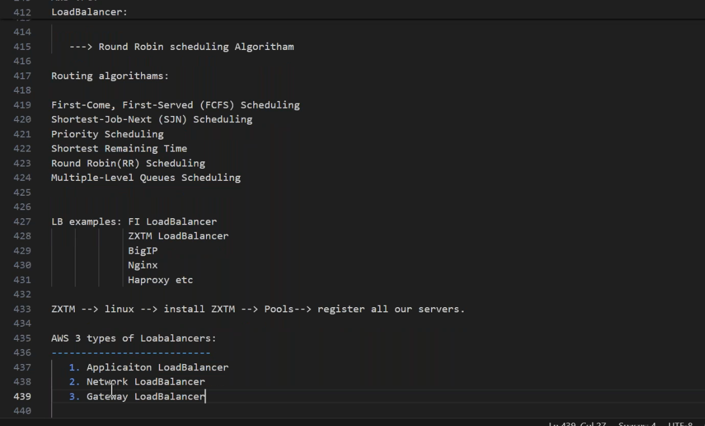
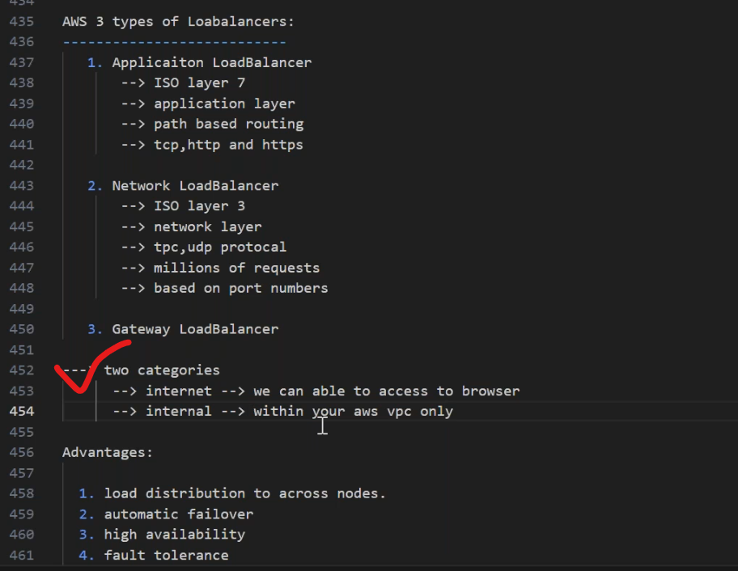

## application layer lb
----------------------------
* layer7 lb
* path/route based routing
* https,http added
## network layer lb
* layer3 lb
* network layer
* tcp,udp
* based on port number
## target groups
---------------------------------
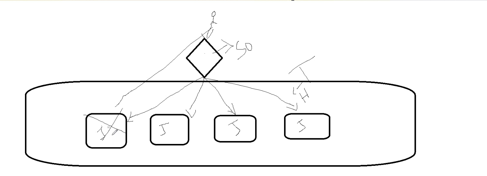

* all the running/required servers are in target group.
## creating LB
--------------------------------------
* before creating loadbalencer create atleast two servers.install some webserver in these servers.
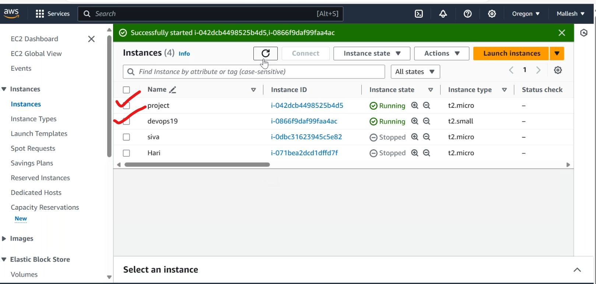
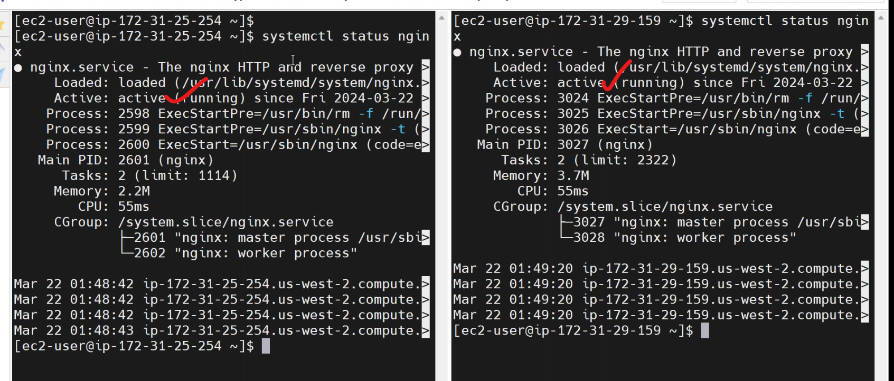

* create one application load balencer.
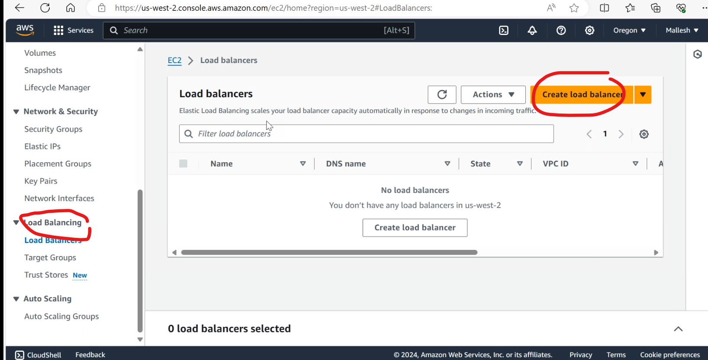

* create a target group
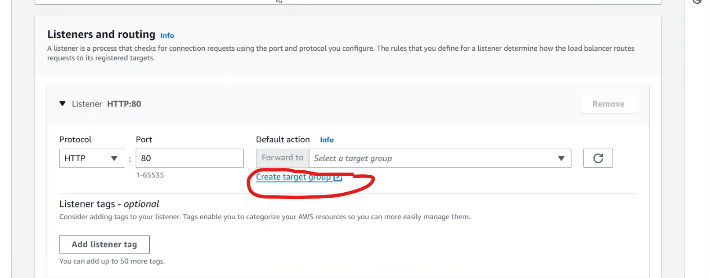
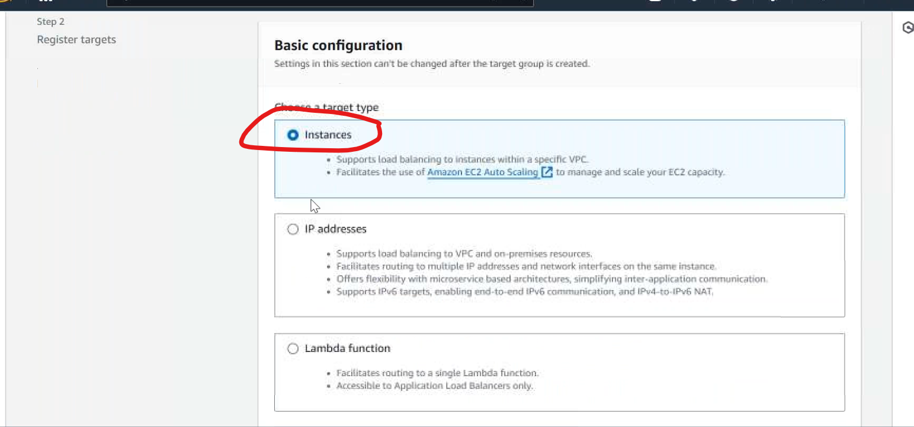

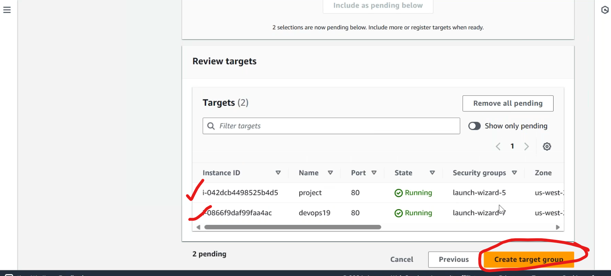
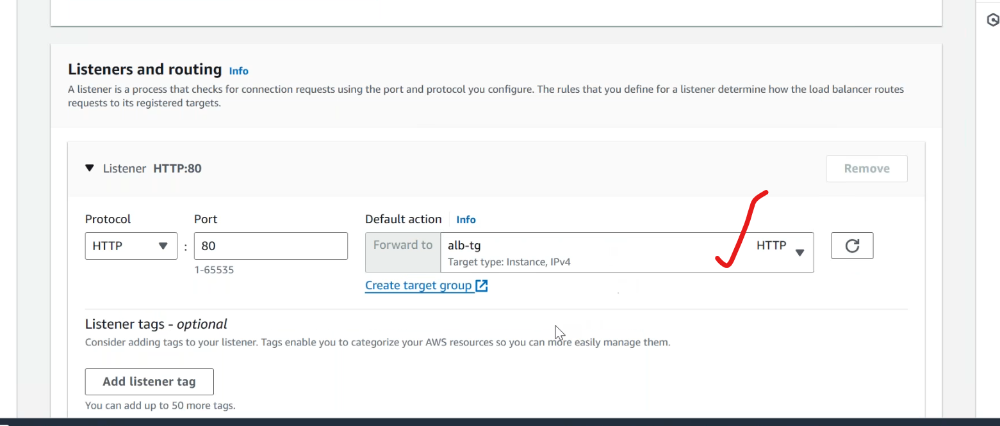
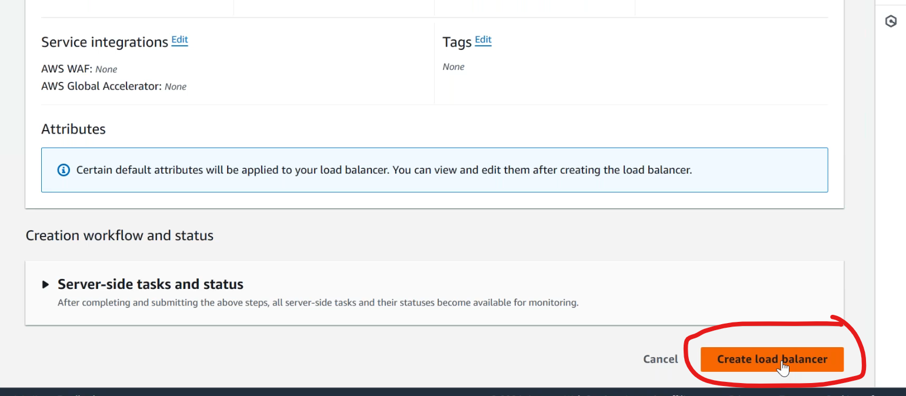
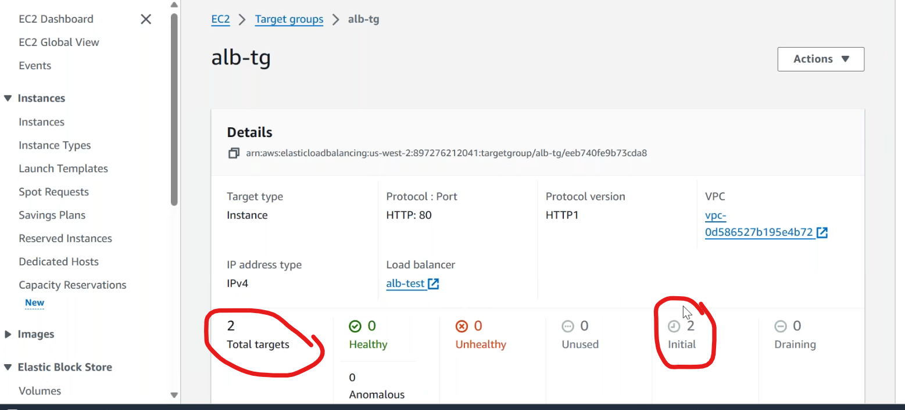

* cpy the DNS name and paste in any browser.
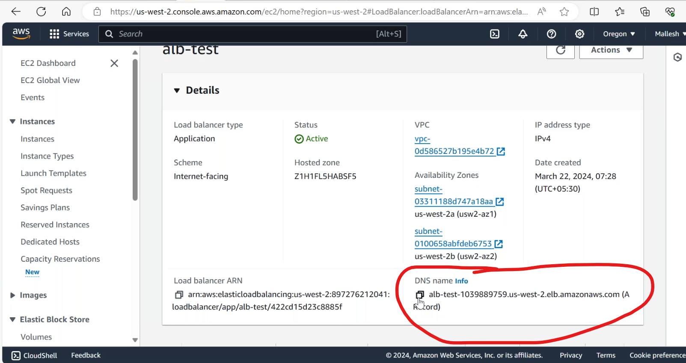
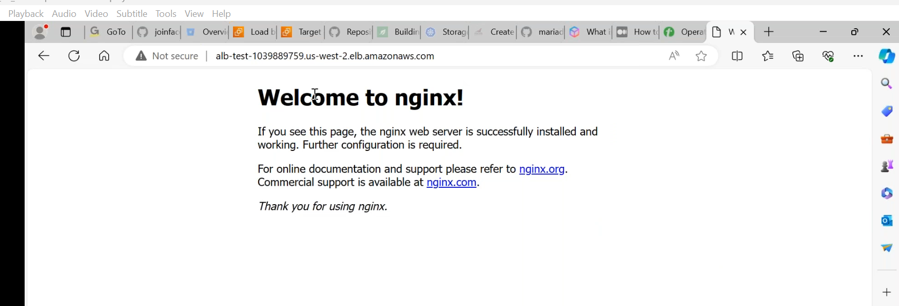
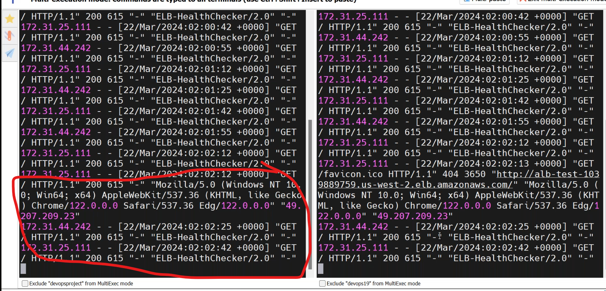
## listeners and rules
-------------------------------------------
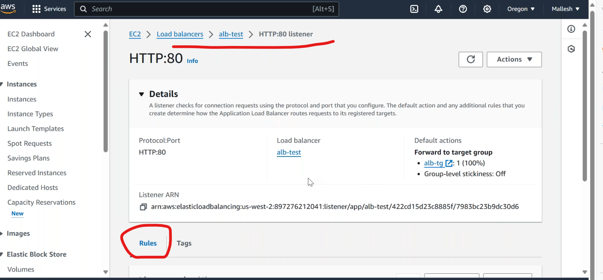
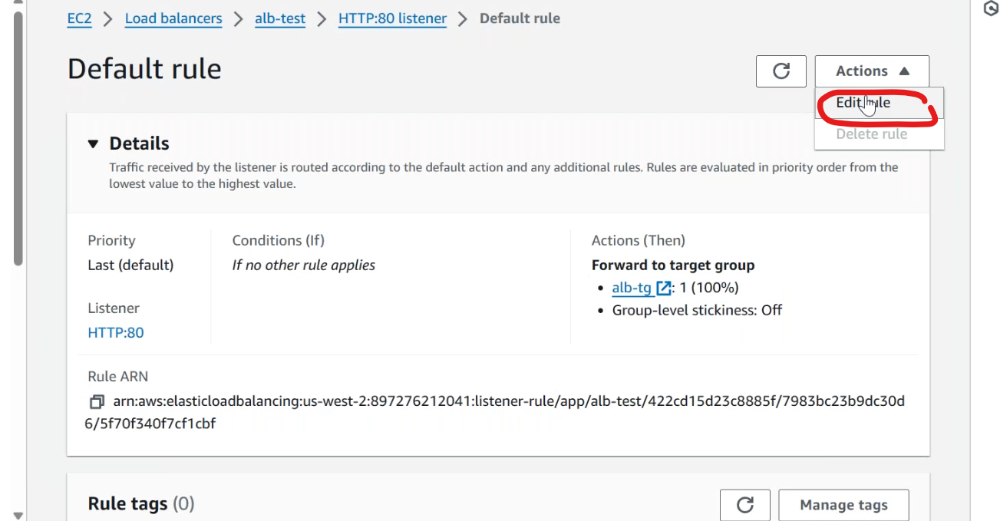
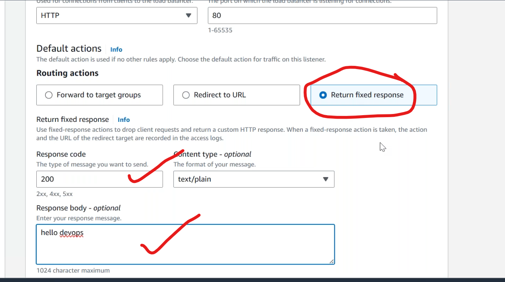

* create one more rule
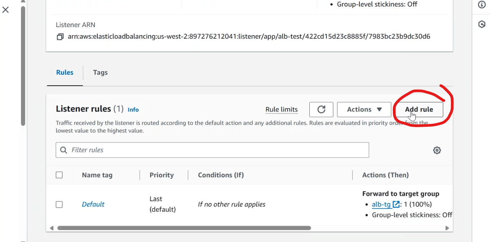
* set cloud watch alarms.for lb level monitering.
 

