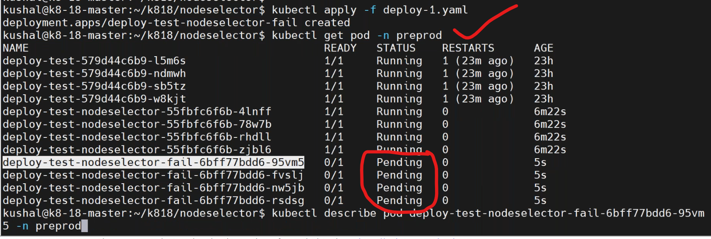
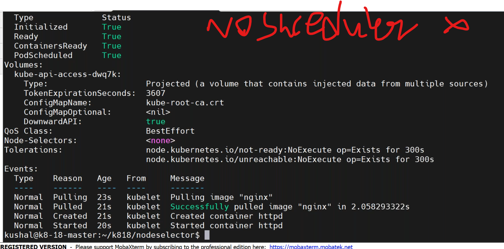
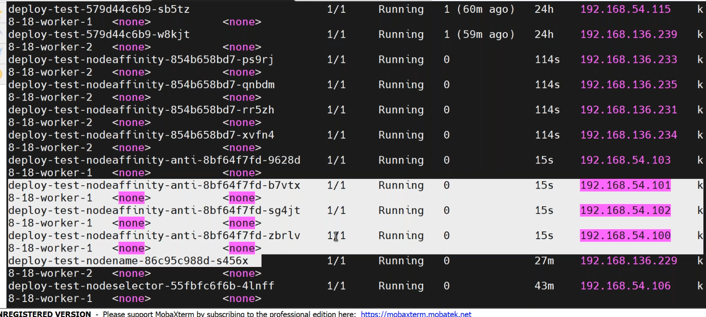

## add labels to nodes
---------------------------------
* to know the labels of pod and node by,
```
kubectl get pod --show-labels
kubectl get nodes --show-labels
kubectl label node <node-name> tier=web
```
### scenario:
--------------------------
* i want to place my web application pods into a specific server which is created for it.
* `solution`: based on labels in the nodes.
## 1. NodeSelector
----------------------------------
* write a manifest on nodeselector by `vi nodeselector.yaml`.
```yaml
apiVersion: apps/v1
kind: Deployment
metadata:
  name: deployment-nodeselector
  labels: 
    purpose: learning
spec:
  selector:
    matchLabels:
      env: dev
  strategy:
    type: RollingUpdate   #default
      maxsurge: 25%
      maxunavialable: 25%
  template:
    metadata:
      name: deployment-roll
      labels:
        env: dev
        company: vtalent
      spec: 
        containers:
          - name: nginx-deployment-nodeselector
            image: nginx:latest
            ports:
              - containerPort: 80
        nodeSelector:
          type: web # add a label to nodes
```
* deploy the maifest by,
```
kubectl apply -f nodeselector.yaml
kubectl get po -n preprod -o wide
```

* write a manifest for nodeselector by `vi nodeselector-fail`.
```yaml
apiVersion: apps/v1
kind: Deployment
metadata:
  name: deployment-nodeselectorfail
  labels: 
    purpose: learning
spec:
  selector:
    matchLabels:
      env: dev
  strategy:
    type: RollingUpdate   #default
      maxsurge: 25%
      maxunavialable: 25%
  template:
    metadata:
      name: deployment-roll
      labels:
        env: dev
        company: vtalent
      spec: 
        containers:
          - name: nginx-deployment-nodeselector-fail
            image: nginx:latest
            ports:
              - containerPort: 80
        nodeSelector:
          type: db # add a label to nodes
```
* to deploy manifest by,
```
kubectl apply -f nodeselector-fail.yaml
kubectl describe pod <pod-name> -n preprod
```


## 2. NodeName
-------------------------------------
* write a minifest on nodename `vi nodename.yaml`.
```yaml
apiVersion: apps/v1
kind: Deployment
metadata:
  name: deployment-nodename
  labels: 
    purpose: learning
spec:
  selector:
    matchLabels:
      env: dev
  strategy:
    type: RollingUpdate   #default
      maxsurge: 25%
      maxunavialable: 25%
  template:
    metadata:
      name: deployment-roll
      labels:
        env: dev
        company: vtalent
      spec: 
        containers:
          - name: nginx-deployment-nodename
            image: nginx:latest
            ports:
              - containerPort: 80
        nodeName: node1 # give nodes name
```
* deploy the manifest by
```
kubectl apply -f nodename.yaml
kubectl get po -n preprod
kubectl describe po <pod-name> -n preprod
```

* there is no `shceduler` involvement in this.
  
## 3. NodeAffinity
----------------------------------
* `affinity` --> place pods to specific node
* `antiaffinity` --> don't allocate to me in this label server and allocate to me anywhere else.
### Affinity:
* Node.
    * affinity
    * antiaffinity
* pod 
    * affinity
    * antiaffinity
* categories.
## 1. hard affinity
--------------------------------------------   
* write a manifest on nodeaffinity by `vi nodeaffinity.yaml`.
```yaml
apiVersion: apps/v1
kind: Deployment
metadata:
  name: deployment-nodeaffinity
  labels: 
    purpose: learning
spec:
  selector:
    matchLabels:
      env: dev
  strategy:
    type: RollingUpdate   #default
      maxsurge: 25%
      maxunavialable: 25%
  template:
    metadata:
      name: deployment-roll
      labels:
        env: dev
        company: vtalent
      spec: 
        containers:
          - name: nginx-deployment-nodeaffinity
            image: nginx:latest
            ports:
              - containerPort: 80
        affinity:
          nodeAffinity:    #hard affinity
            requiredDuringSchedulingIgnoredDuringExecution: #strict follow
              nodeSelectorTerms:
                matchExpressions:
                  - key: batch  # add a label batch=18 to one of the nodes
                    operator: In
                    values:
                      - `18` # string if integer we got error                    
```
* to deploy manifest by,
```
kubectl apply -f nodeaffinity.yaml
kubectl get pod -n preprod -n -o wide
```


* write a manifest file on antiaffinity by `vi antiaffinity.yaml`.
```yaml
apiVersion: apps/v1
kind: Deployment
metadata:
  name: deployment-node-antiaffinity
  labels: 
    purpose: learning
spec:
  selector:
    matchLabels:
      env: dev
  strategy:
    type: RollingUpdate   #default
      maxsurge: 25%
      maxunavialable: 25%
  template:
    metadata:
      name: deployment-roll
      labels:
        env: dev
        company: vtalent
      spec: 
        containers:
          - name: nginx-deployment-nodeantiaffinity
            image: nginx:latest
            ports:
              - containerPort: 80
        affinity:
          nodeAffinity:    #hard affinity
            requiredDuringSchedulingIgnoredDuringExecution: #strict follow
              nodeSelectorTerms:
                matchExpressions:
                  - key: batch  # add a label batch=18 to one of the nodes
                    operator: NotIn
                    values:
                      - `18` # string if integer we got error                    
```
* deploy the manifest by,
```
kubectl apply -f antiaffinity.yaml
kubectl get po -n preprod 
```



